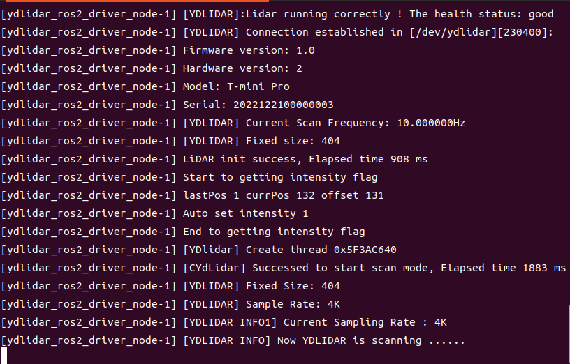
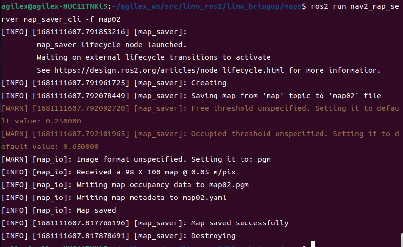
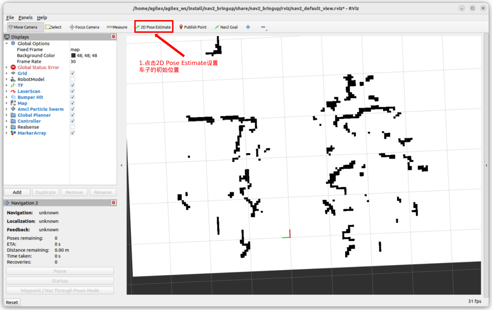
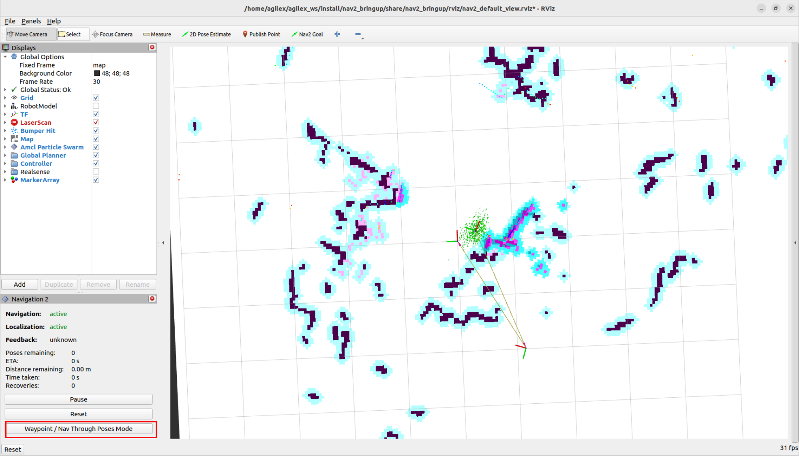
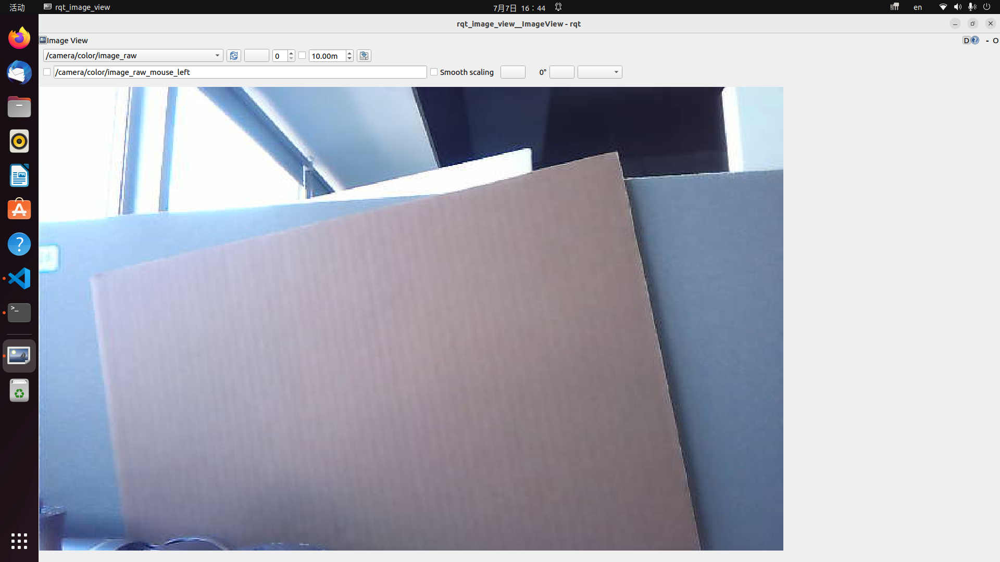
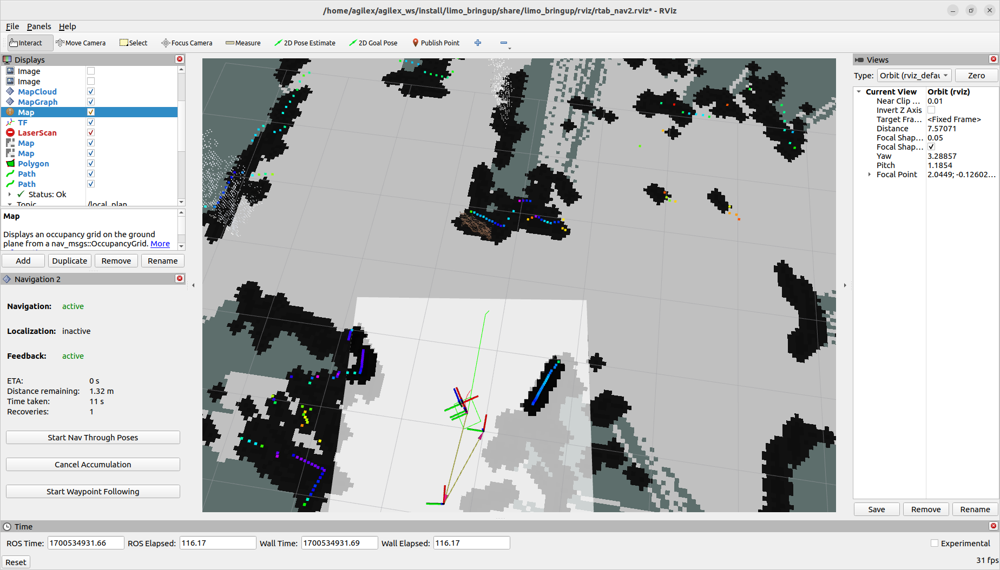
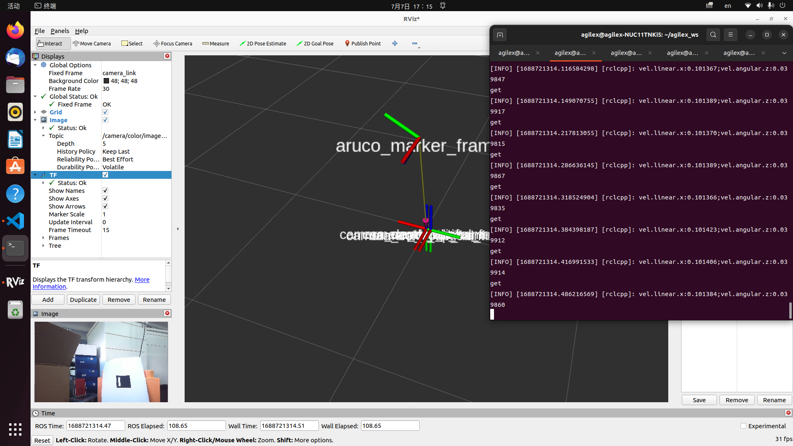
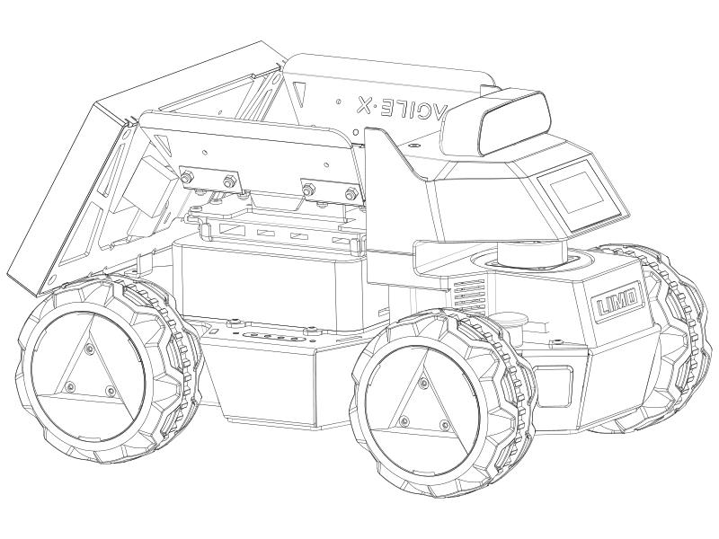
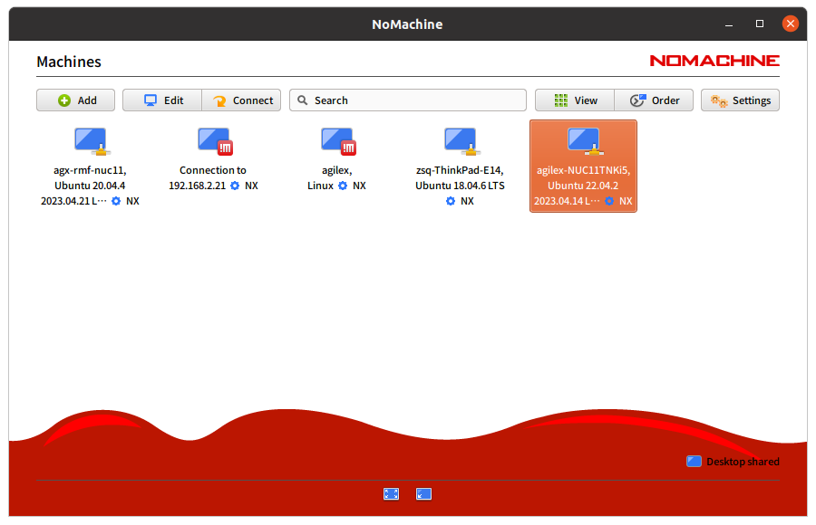

[TOC]

## 第1章 LIMO机器人简介

### 1.1 LIMO机器人

松灵LIMO机器人是全球首款集四种运动模态于一体的ROS开发平台，提供了适应场景更广泛、更符合行业应用要求的学习平台，适用于机器人教育、功能研发、产品开发。通过创新性的机械设计，能实现四轮差速、阿克曼、履带型、麦克纳姆轮运动模式的快速切换，可在配套的专业沙盘中快速建立多场景实拟教学和测试，LIMO搭载NUC、EAI T-mini Pro激光雷达、深度相机等高性能传感器配置，可实现精确的自主定位、SLAM建图、路线规划和自主避障、红绿灯识别等丰富功能。

### 1.2 产品列表

| 名称                            | 数量 |
| ------------------------------- | ---- |
| LIMO高配版主体（安装越野轮 X4） | X1   |
| 电池                            | X1   |
| 充电器                          | X1   |
| APP_Agilex                      | X1   |

 

### 1.3 性能参数

<table>
	<tr>
		<td>参数类型</td>
		<td>项目</td>
        <td>指标</td>
	</tr>
	<tr>
		<td rowspan="7">机械参数</td>
		<td>外形尺寸</td>
        <td>322*220*251mm</td>
	</tr>
	<tr>
		<td>轴距</td>
        <td>200mm</td>
	</tr>
    	<tr>
		<td>轮距</td>
        <td>175mm</td>
	</tr>
    	<tr>
		<td>自重</td>
        <td>4.8kg</td>
	</tr>
    	<tr>
		<td>负载</td>
        <td>4kg</td>
	</tr>
    	<tr>
		<td>最小离地间隙</td>
            <td>24mm</td>
	</tr>
    	<tr>
		<td>驱动方式</td>
            <td>轮毂电机(4x14.4W)</td>
	</tr>
<tr>
		<td rowspan="4">性能参数</td>
		<td>空载最高车速</td>
        <td>1m/s</td>
	</tr>
<tr>
		<td>阿克曼最小转弯半径</td>
        <td>0.4m</td>
	</tr>
<tr>
		<td>工作环境</td>
        <td>-10~+40℃</td>
	</tr>
<tr>
		<td>最大爬坡角度</td>
        <td>20°</td>
	</tr>
	<td rowspan="11">系统参数</td>
		<td>电源接口</td>
        <td>DC（5.5x2.1mm)</td>
	</tr>
    	<tr>
		<td>工控机</td>
        <td>Interl NUC11</td>
	</tr>
	<tr>
		<td>系统</td>
        <td>Ubuntu22.04</td>
	</tr>
    	<tr>
		<td>IMU</td>
        <td>HI226</td>
	</tr>
    	<tr>
		<td>CPU</td>
        <td>i7-1135G7@2.40GHz x 8</td>
	</tr>
    	<tr>
	</tr>
    	<tr>
		<td>GPU</td>
        <td>Xe Graphics</td>
	</tr>
    	<tr>
		<td>电池</td>
            <td>10Ah 12V</td>
	</tr>
    	<tr>
		<td>工作时间</td>
            <td>2.5H</td>
	</tr>
    	<tr>
		<td>待机时间</td>
            <td>4h</td>
	</tr>
    	<tr>
		<td>通讯接口</td>
            <td>WIFI、蓝牙</td>
	</tr>
	<td rowspan="5">传感器</td>
		<td>激光雷达</td>
        <td>EAI T-mini Pro</td>
	</tr>
	<tr>
		<td>深度相机</td>
        <td>奥比中光 DaBai</td>
	</tr>
    	<tr>
		<td>USB-HUB </td>
            <td>TYPE-C x1、USB2.0 x2、HDMI</td>
	</tr>
    	<tr>
		<td>前显示器</td>
            <td>1.54寸128x64白色OLED显示屏</td>
	</tr>
    	<tr>
		<td>后显示器</td>
            <td>7寸1024x600 IPS触控屏</td>
	</tr>
	<td rowspan="2">控制参数</td>
		<td>控制模式</td>
        <td>手机APP、指令控制</td>
	</tr>
	<tr>
		<td>手机APP</td>
        <td>蓝牙/极限距离10m</td>
	</tr>
</table>

### 1.4 操作说明

（1）长按开关键开机（短按暂停程序），观察电量表，最后一颗红灯亮时请及时充电或更换电池；


（2）观察前面插销状态以及车灯颜色判断当前模式：


<table>
<tr>
	<td>插销状态</td>
	<td>车灯颜色</td>
	<td>当前模式</td>
</tr>
	<tr>
        <td rowspan="1"> 插入</td> 
        <td>黄色</td>
        <td>四轮差速/履带模式</td>
    </tr>
<tr>
	<td>拔起</td>
	<td>绿色</td>
	<td>阿克曼</td>
</tr>
</table>

<div STYLE="page-break-after: always;"></div>

## 第2章 底盘电气信息说明

###  2.1 电池与充电

#### 2.1.1 电池基本信息

 LIMO随车配备一个12V的电池，该电池有两个接口。分别为黄色的电池输出接口和黑色的电池充电接口。

该电池参数如下表：

| 项目             | 额定参数 |
| ---------------- | -------- |
| 典型容量         | 10AH     |
| 最小容量10       | 10AH     |
| 标称电压         | 11.1V    |
| 充电截止电压     | 12.6V    |
| 放电截止电压     | 8.25V    |
| 最大持续放电电流 | 10A      |

##### 电池注意事项

------

- 为了保证运输存储安全，LIMO配备的电池并不一定处于满电状态 。
- 请不要在电池使用殆尽以后再进行充电，当 LIMO提示电量低时，请及时充电。
- LIMO在关机状态下仍会产生静态待机电流，为防止电池过放，长时间不使用LIMO时请断开电池与车体的连接。
- 请勿将电池投火中，或对电池加热，请勿在高温下存储电池，电池存储的最佳温度为-25℃~45℃。
- 必须使用原厂配备或认证的电池为LIMO供电。

------

####  2.1.2 充电

LIMO默认随车配备一个12.6V 5A的充电器，可满足客户的充电需求，且充电器上设有指示灯可显示充电状态。

------

- 充电时请关机取出电池，将电池输出接口与车体分离。
- 将充电器的充电接头与电池连接，再接通充电器电源进行充电。
- 充满时请先将电池与充电器分离，再断开充电器电源。

------

充电器状态如下表：

| 充电器指示灯颜色 | 电池状态 |
| ---------------- | -------- |
| 红色             | 充电中   |
| 绿色闪烁         | 即将充满 |
| 绿色             | 已充满   |

##### 充电注意事项：

------

- 禁止使用非原装充电器对电池进行充电，请勿在0℃以下给电池充电。

- 当充电器指示灯变为绿色时表示充电完毕，但为了延长电池寿命，充电器会以0.1A的电流进行涓流充电，持续约0.5小时。
- 当前电池从8.25V到充满电状态大约需要2.5小时，电池充满电电压约为12.6V。

## 第3章 底盘驱动程序

移动底盘需要通过程序驱动才能实现limo的导航，limo的底盘驱动程序目前只有C++版本

### 3.1 驱动程序文件结构

底盘驱动程序所在文件夹为~/agilex_ws/src/limo_ros2/limo_base，可以通过以下命令进入到该文件夹中

```
cd ~/agilex_ws/src/limo_ros2/limo_base
```

以下是limo_base功能包的文件列表：

```
├── CMakeLists.txt
├── include
│   └── limo_base
├── launch
│   ├── limo_base.launch.py
│   ├── open_ydlidar_launch.py
│   └── start_limo.launch.py
├── package.xml
├── scripts
│   └── tf_pub.py
└── src
    ├── limo_base_node.cpp
    ├── limo_driver.cpp
    ├── serial_port.cpp
    └── tf_pub.cpp

```

底盘驱动程序用到的消息文件，所在文件夹为~/agilex_ws/src/limo_ros2/limo_msgs，可以通过以下命令进入到该文件夹中

```
cd ~/agilex_ws/src/limo_ros2/limo_msgs
```

以下是limo_msgs功能包的文件列表：

```
├── action
│   └── LimoAction.action
├── CMakeLists.txt
├── msg
│   └── LimoStatus.msg
├── package.xml
└── srv
    └── LimoSrv.srv

```

两个功能包下分别有include、launch、src、scripts、action、srv、msg。include文件夹下存放着驱动程序所调用的库文件；launch文件夹下存放着驱动程序的启动文件；scripts文件夹下存放着Python代码；action文件夹下存放着action动作消息文件；srv文件夹下存放着server消息文件；msg文件夹下存放着msg消息文件；src文件夹下存放着驱动程序C++源代码。

| 文件夹  | 存放文件                 |
| ------- | ------------------------ |
| include | 驱动程序所调用的库文件   |
| launch  | 驱动程序的启动文件       |
| msg     | 驱动程序所需要的消息文件 |
| src     | 驱动程序源代码           |
| scripts | Python代码               |
| action  | action动作消息文件       |
| srv     | server消息文件           |

### 3.2 Msg文件

在ROS 2中，Msg文件（Message文件）用于定义ROS 2中的自定义消息类型。Msg文件描述了消息的结构和字段，并且可以根据需要定义多个字段和数据类型。

以下是Limo中自定义的Msg文件，LimoStatus.msg：

```
std_msgs/Header header

uint8 vehicle_state
uint8 control_mode
float64 battery_voltage
uint16 error_code
uint8 motion_mode
```

这里自定义了关于Limo状态的消息文件，每个字段的代表的意思如下：

1. std_msgs/Header header：这是一个标准消息类型std_msgs/Header，它包含了时间戳和消息的来源信息。
2. uint8 vehicle_state：这是一个无符号8位整数类型的字段，用于表示车辆状态。
3. uint8 control_mode：这是一个无符号8位整数类型的字段，用于表示控制模式。
4. float64 battery_voltage：这是一个64位浮点数类型的字段，用于表示电池电压。
5. uint16 error_code：这是一个无符号16位整数类型的字段，用于表示错误代码。
6. uint8 motion_mode：这是一个无符号8位整数类型的字段，用于表示运动模式。

可以在ROS 2节点的C++或Python代码中使用这个消息类型进行发布和订阅操作，按照定义的字段进行赋值和访问。

### 3.3 srv文件

在ROS 2中，Srv文件（Service文件）用于定义ROS 2中的自定义服务类型。Srv文件描述了服务的请求和响应的结构，以及相关的字段和数据类型。

以下是自定义的Srv文件，LimoSrv.srv：

```
# LimoSrv.srv
float32 x
float32 y
float32 z
---
std_msgs/Bool success

```

每个字段的代表的意思如下：

请求部分包含了三个字段：

- float32 x：代表请求中的 x 坐标值，类型为 32 位浮点数。
- float32 y：代表请求中的 y 坐标值，类型为 32 位浮点数。
- float32 z：代表请求中的 z 坐标值，类型为 32 位浮点数。

响应部分包含了一个字段：

- std_msgs/Bool success：代表服务执行的结果，类型为 std_msgs/Bool，用于指示服务是否成功完成。

通过定义这些字段，该服务类型可以用于在ROS 2系统中传递包含坐标值的请求，并返回执行结果。可以在ROS 2节点的C++或Python代码中使用这个服务类型，例如提供服务或调用服务。在服务提供者端，你可以接收包含 x、y 和 z 坐标的请求，并根据请求执行相应的操作。然后，将执行结果封装到 std_msgs/Bool 类型的响应中，并将响应发送回请求方。在服务调用者端，你可以创建一个请求，填充 x、y 和 z 坐标的值，然后发送该请求给服务提供者。然后，等待接收到响应，并解析响应中的 success 字段以获取执行结果。

### 3.4 action文件

在ROS 2中，Action文件用于定义ROS 2中的自定义Action类型。Action类型允许在节点之间进行长期的异步通信，并通过在请求和响应之间进行交互来实现更复杂的行为。

以下是自定义的Action文件，LimoAction.action：

```
# LimoAction.action
float32 x
float32 y
float32 z
---
std_msgs/Bool success
---
uint32 status
```

每个字段的代表的意思如下：

目标（Goal）部分包含了三个字段：

- float32 x：代表目标中的 x 坐标值，类型为 32 位浮点数。
- float32 y：代表目标中的 y 坐标值，类型为 32 位浮点数。
- float32 z：代表目标中的 z 坐标值，类型为 32 位浮点数。

结果（Result）部分包含了一个字段：

- std_msgs/Bool success：代表Action执行的结果，类型为 std_msgs/Bool，用于指示Action是否成功完成。

反馈（Feedback）部分包含了一个字段：

- uint32 status：代表Action执行的状态，类型为无符号32位整数。

通过定义这些字段，该Action类型可以用于在ROS 2系统中传递包含坐标值的目标，并返回执行结果和执行状态的反馈。然后，你可以在ROS 2节点的C++或Python代码中使用这个Action类型，例如创建Action客户端和服务器。

在Action客户端端，你可以创建一个目标，填充 x、y 和 z 坐标的值，并发送该目标给Action服务器。然后，等待接收到结果和反馈，并解析结果和反馈中的字段以获取执行结果和执行状态。

在Action服务器端，你可以接收包含 x、y 和 z 坐标的目标，并根据目标执行相应的操作。然后，将执行结果和执行状态封装到结果和反馈中，并发送给Action客户端。

### 3.5 Limo的话题

在ROS 2中，话题（Topic）是一种常用的通信机制，用于在ROS 2节点之间传输消息。话题采用发布-订阅（Publish-Subscribe）模型，其中一个节点发布（Publish）消息到特定的话题，而其他节点订阅（Subscribe）该话题以接收消息。

启动Limo底盘驱动程序：

```
ros2 launch limo_base limo_base.launch.py
```

启动Limo底盘驱动程序的时候会发布以下话题：

```
/cmd_vel
/imu
/limo_status
/parameter_events
/rosout
/tf
/tf_static
/wheel/odom
```


以下是对这些ROS 2话题的简要解释：

1. /cmd_vel：
   - 作用：用于控制机器人的速度和方向。
   - 消息类型：geometry_msgs/msg/Twist
2. /imu：
   - 作用：发布惯性测量单元（Inertial Measurement Unit，IMU）的数据，如加速度、角速度和姿态。
   - 消息类型：sensor_msgs/msg/Imu。
3. /limo_status：
   - 作用：发布关于机器人状态的信息，如电池电量、错误码等。
   - 消息类型：自定义消息类型，根据具体的应用而定。
4. /parameter_events：
   - 作用：发布与ROS参数服务器相关的事件，如参数修改、添加或删除。
   - 消息类型：rcl_interfaces/ParameterEvent。
5. /rosout：
   - 作用：用于记录ROS节点的日志消息。
   - 消息类型：rosgraph_msgs/Log。
6. /tf：
   - 作用：发布机器人的坐标变换信息，用于实现坐标系之间的转换。
   - 消息类型：tf2_msgs/msg/TFMessage。
7. /tf_static：
   - 作用：发布静态的坐标变换信息，与/tf话题类似，但这些变换不会随时间而改变。
   - 消息类型：tf2_msgs/msg/TFMessage。
8. /wheel/odom：
   - 作用：发布机器人轮式里程计数据，用于估计机器人在地面上的运动。
   - 消息类型：nav_msgs/msg/Odometry。

## 第4章 激光雷达建图

### 4.1 激光雷达介绍和使用

YDLIDAR T-mini Pro 激光雷达是深圳玩智商科技有限公司（EAI）研发的一款 360°2D 激光雷达（以下简称：T-mini Pro）。本产品基于脉冲 ToF 测距原理，并配以相关光学、电 学、算法设计，实现高频高精度的距离测量，同时，机械结构 360 度旋转，不断获取角度信 息，从而实现了 360 度扫描测距，输出扫描环境的点云数据。

| 项目       | 最小值 | 默认值 | 最大值 | 单位 | 备注                                 |
| ---------- | ------ | ------ | ------ | ---- | ------------------------------------ |
| 测距频率   | /      | 4000   | /      | Hz   | 每秒测距 4000 次                     |
| 扫描频率   | 6      | 6      | 12     | Hz   | 需要接入 PWM 信号，推荐 使用转速 6Hz |
| 测距范围   | 0.02   | /      | 12     | m    | 室内环境，80%反射率物体              |
| 扫描角度   | /      | 0-360  | /      | Deg  | /                                    |
| 测距精度   | /      | 20     | /      | mm   | 0.05m <测距≤12m 时                   |
| 俯仰角     | 0      | 0.75   | 1.5    | Deg  | /                                    |
| 角度分辨率 | 0.54   |        |        | Deg  |                                      |

其使用方式如下：

打开一个新的终端，在终端中输入命令：

```
ros2 launch ydlidar_ros2_driver ydlidar.launch.py
```

成功打开之后，终端会输出以下日志信息，如图：



然后新开启一个终端，在终端中输入命令：

```
ros2 launch limo_bringup lidar_rviz.launch
```

成功运行之后会看到rviz可视化工具打开，其中显示的绿色数据就是雷达扫描出来的激光数据。


scan话题的消息类型：sensor_msgs/msg/LaserScan。

- `header`：消息头，包含时间戳和帧ID等信息。
- `angle_min`：激光扫描的最小角度。
- `angle_max`：激光扫描的最大角度。
- `angle_increment`：激光扫描的角度增量。
- `time_increment`：每个激光扫描的时间增量。
- `scan_time`：激光扫描的总时间。
- `range_min`：激光测距的最小范围。
- `range_max`：激光测距的最大范围。
- `ranges`：激光测距数据的数组，表示每个角度对应的距离值。
- `intensities`：激光测距强度数据的数组，可选字段。

通过订阅`/scan`话题，其他节点可以接收并处理激光雷达的扫描数据。常见的应用包括建图、障碍物检测、导航和路径规划等。

### 4.2 cartographer建图

#### 4.2.1 cartographer建图算法介绍

cartographer是google推出的一套基于图优化的SLAM算法。该算法的主要目标是实现低计算资源消耗，达到实时SLAM的目的。该算法主要分为两个部分，第一个部分称为Local SLAM, 该部分通过一帧帧的Laser Scan建立并维护一系列的Submap，而所谓的submap就是一系列的Grid Map。算法的第二个部分，称为Global SLAM的部分，就是通过Loop Closure来进行闭环检测，来消除累积误差：当一个submap构建完成，也就是不会再有新的laser scan插入到该submap时，算法会将该submap加入到闭环检测中。

#### 4.2.2 cartographer建图实践操作

> 注：在运行命令之前，请确保其他终端中的程序已经终止，终止命令为：Ctrl+c
>

> 注：建图过程中limo的速度尽量慢点，速度太快会影响建图的效果
>

首先需要启动雷达，打开一个新终端，在终端中输入命令：

```
ros2 launch limo_bringup limo_start.launch.py
```

然后启动cartographer建图算法，打开另一个新终端，在终端中输入命令：

```
ros2 launch limo_bringup limo_cartographer.launch.py
```

成功启动之后会弹出rviz可视化界面，如下图：


在构建完地图之后需要保存地图，需要在终端中输入命令：

```
ros2 run nav2_map_server map_saver_cli -f map
```



## 第5章 雷达导航

前面我们使用了两种激光建图方式，接下来利用刚刚构建地图进行导航。

### 5.1 导航框架

导航的关键是机器人定位和路径规划两大部分。针对这两个核心,ROS提供了以下两个功能包。

（1）move_base：实现机器人导航中的最优路径规划。

（2）amcl：实现二维地图中的机器人定位。

在上述的两个功能包的基础上，ROS提供了一套完整的导航框架，


机器人只需要发布必要的传感器信息和导航的目标位置,ROS即可完成导航功能。在该框架中,move_base功能包提供导航的主要运行、交互接口。为了保障导航路径的准确性,机器人还要对自己所处的位置进行精确定位,这部分功能由amcl功能包实现。

#### 5.1.1 move_base 功能包

move_base是ROS中完成路径规划的功能包,主要由以下两大规划器组成。

全局路径规划(global_planner)。全局路径规划是根据给定的目标位置和全局地图进行总体路径的规划。在导航中,使用Dijkstra或A*算法进行全局路径的规划,计算出机器人到目标位置的最优路线,作为机器人的全局路线。

本地实时规划(local_planner)。在实际情况中,机器人往往无法严格按照全局路线行驶,所以需要针对地图信息和机器人附近随时可能出现的障碍物规划机器人每个周期内应该行驶的路线,使之尽量符合全局最优路径。

#### 5.1.2 amcl 功能包

自主定位即机器人在任意状态下都可以推算出自己在地图中所处的位置。ROS为开发者提供了一种自适应(或kld采样)的蒙特卡罗定位方法(amcl), 这是一种概率定位系统，以2D方式对移动机器人定位。 它实现了自适应（或者KLD-采样）蒙特卡洛定位法，使用粒子滤波跟踪机器人在已知地图中的位姿。

#### 5.1.3 DWA_planner和TEB_planner介绍

DWA_planner

DWA 的全称为DynamicWindow Approaches，该算法可以搜索躲避和行进的多条路经,综合各评价标准(是否会撞击障碍物,所需要的时间等)选取最优路径,并且计算行驶周期内的线速度和角速度,避免与动态出现的障碍物发生碰撞。

TEB_planner

“TEB”全称Time Elastic Band（时间弹性带）Local Planner，该方法针对全局路径规划器生成的初始轨迹进行后续修正(modification)，从而优化机器人的运动轨迹，属于局部路径规划。在轨迹优化过程中，该算法拥有多种优化目标，包括但不限于：整体路径长度、轨迹运行时间、与障碍物的距离、通过中间路径点以及机器人动力学、运动学以及几何约束的符合性。“TEB方法”明确考虑了运动状态下时空方面的动态约束，如机器人的速度和加速度是有限制的。

### 5.2 limo导航功能

> 注：四轮差速模式和全向轮模式、履带模式下，导航运行的文件一样
>

注：在运行命令之前，请确保其他终端中的程序已经终止，终止命令为：Ctrl+c

（1）首先启动雷达，在终端中输入命令：

```
ros2 launch limo_bringup limo_start.launch.py
```

（2）启动导航功能，在终端中输入命令：

```
ros2 launch limo_bringup limo_nav2.launch.py
```

注：如果是阿克曼运动模式，请运行：

```
roslaunch limo_bringup limo_navigation_ackerman.launch
```

启动成功之后会打开rviz界面，如图 ：


> 注：如需自定义打开的地图，请打开limo_nav2.launch.py 文件修改参数, 文件所在目录为：~/agilex_ws/src/limo_ros/limo_bringup/launch。请把map01修改为需要更换的地图名称。
>


（3）开启导航之后，会发现激光扫描出来的形状和地图没有重合，需要我们手动校正，在rviz中显示的地图上矫正底盘在场景中实际的位置，通过rviz中的工具，发布一个大概的位置，给limo一个大致的位置，然后通过手柄遥控limo旋转，让其自动校正，当激光形状和地图中的场景形状重叠的时候，校正完成。操作步骤如图 ：



校正完成后


（4）通过2D Nav Goal 设置导航目标点。


地图中将会生成一条紫色的路径，手机切换至指令模式，limo将自动导航到目标点。

（5）多点导航功能

点击红色框中的按钮，进入多点导航模式



点击Nav2 Goal，在地图上打点，给完点之后，点击红框中的按钮，开始导航。


## 第6章 视觉建图与导航

### 6.1 ORBBEC®Dabai的介绍与使用

ORBBEC®Dabai 是基于双目结构光 3D 成像技术的深度相机，主要包括左红外相机(IR camera1)、右红外相机(IR camera2)、一个红外投影仪(IR projector)以及深度计算处理器(depth processor)。红外投影仪用于向目标场景(Scene)投射结构光图案(散斑图案)，左红外相机以及或红外相机分别采集目标的左红外结构光图像以及右红外结构光图像，深度计算处理器接收左红外结构光图像、右红外结构光图像后执行深度计算算法并输出目标场景的深度图像。

| 参数名称                         | 参数指标                                                     |
| -------------------------------- | ------------------------------------------------------------ |
| 左、右红外相机成像中心之间的距离 | 40mm                                                         |
| 深度距离                         | 0.3-3m                                                       |
| 功耗                             | 整机工作平均功耗<2W,<br/>激光开启瞬间峰值 <5W(持续时间 3ms),<br/>待机功耗典型值为<0.7W |
| 深度图分辨率                     | 640X400@30FPS<br/>320X200@30FPS                              |
| 彩色图分辨率                     | 1920X1080@30FPS<br/>1280X720@30FPS<br/>640X480@30FPS         |
| 精度                             | 6mm@1m(81%FOV区域参与精度计算*)                              |
| 深度 FOV                         | H 67.9° V 45.3°                                              |
| 彩色 FOV                         | H 71° V43.7° @1920X1080                                      |
| 延迟                             | 30-45ms                                                      |
| 数据传输                         | USB2.0 或以上                                                |
| 支持操作系统                     | Android / Linux / Windows7/10                                |
| 供电方式                         | USB                                                          |
| 工作温度                         | 10°C ~ 40°C                                                  |
| 适用场景                         | 室内 / 室外(具体以应用场景和相关算法要求为准)                |
| 防尘防水                         | 基础防尘                                                     |
| 安全性                           | Class1 激光                                                  |
| 尺寸(毫米)                       | 长59.6X宽17.4X厚11.1mm                                       |

了解ORBBEC®Dabai的基本参数之后，开始实践操作

注：在运行命令之前，请确保其他终端中的程序已经终止，终止命令为：Ctrl+c 

首先启动ORBBEC®Dabai摄像头，运行下面的命令：

```
ros2 launch astra_camera dabai.launch.py
```

打开rqt_image_view：

```
ros2 run rqt_image_view rqt_image_view
```



### 6.2 rtabmap算法介绍

RTAB-Map（Real-Time Appearance-Based Mapping）是一种用于同时定位与地图构建（SLAM）的算法，旨在在实时性能和地图质量之间取得平衡。RTAB-Map是基于图的SLAM系统，能够在运行时（real-time）构建稠密的3D地图。

以下是RTAB-Map的一些关键特点和组成部分：

1. **实时性能：** RTAB-Map致力于在实时应用中运行，如机器人导航或增强现实系统。其算法设计旨在最大程度地减小计算负担，以便在有限的计算资源下实现快速而准确的地图构建和定位。
2. **基于特征的SLAM：** RTAB-Map使用视觉和惯性传感器数据，通过提取关键点和描述子进行特征匹配，以便在连续的帧之间进行定位和地图构建。这使得它能够在缺乏精确运动模型的情况下执行SLAM。
3. **环境感知：** RTAB-Map通过环境感知（如深度信息、视差等）增强地图的质量。这对于处理具有纹理较少或存在重复结构的环境非常有用。
4. **循环检测和闭环优化：** RTAB-Map通过循环检测来识别之前访问过的地图区域，然后通过优化技术来校正先前的轨迹和地图。这有助于减小误差并提高地图的一致性。
5. **RGB-D传感器支持：** RTAB-Map直接支持RGB-D传感器，如Microsoft Kinect，以获取深度信息，从而提高地图的准确性和稠密程度。

### 6.3 rtabmap建图

> 注：在运行命令之前，请确保其他终端中的程序已经终止，终止命令为：Ctrl+c

> 注：建图过程中limo的速度尽量慢点，速度太快会影响建图的效果

（1）启动雷达，在终端中输入命令：

```
ros2 launch limo_bringup limo_start.launch.py
```

（2）启动相机，在终端中输入命令：

```
ros2 launch astra_camera dabai.launch.py
```

（3）启动rtabmap算法的建图模式，在终端中输入命令：

```
ros2 launch limo_bringup limo_rtab_rgbd.launch.py
```

当构建完地图之后，可以直接终止程序，构建的地图将自动保存在主目录下的.ros文件中，文件名称为rtabmap.db。.ros文件夹为隐藏文件夹，需要通过Ctrl+h指令显示出来。


### 6.4 rtabmap算法导航

> 注：在运行命令之前，请确保其他终端中的程序已经终止，终止命令为：Ctrl+c

（1）启动雷达，在终端中输入命令：

```
ros2 launch limo_bringup limo_start.launch.py
```

（2）启动相机，在终端中输入命令：

```
ros2 launch astra_camera dabai.launch.py
```

（3）启动rtabmap算法的建图模式，在终端中输入命令：

```
ros2 launch limo_bringup limo_rtab_rgbd.launch.py localization:=true
```

（4）启动导航算法，在终端中输入命令：

```
ros2 launch limo_bringup limo_rtab_nav2.launch.py 
```


（5）因为我们用到视觉定位，所以在采用rtabmap导航的时候不需要校正，可以直接开始设置目标点进行导航，操作步骤如图 。



地图中将会生成一条绿色的路径，将limo切换至指令模式，limo将自动导航到目标点

## 第6章 视觉模块

### 6.1 视觉巡线

​	**代码思路**

1. 首先需要对摄像头进行初始化，通过相机发布的消息订阅器来获取图像信息，并将图像转换成OpenCV格式；
2. 对获取的图像进行预处理，包括灰度化、高斯模糊、边缘检测等操作；
3. 对处理后的图像进行二值化处理，将图像转换成黑白二值图；
4. 对二值化后的图像进行形态学操作，包括膨胀、腐蚀、开操作等，以便更好地识别出线条；
5. 使用霍夫变换识别直线，并将其画出；
6. 通过判断直线的斜率和位置，确定机器人需要转动的方向，并控制机器人向目标方向移动。

​	**功能实现**

启动摄像头：

```
ros2 launch astra_camera dabai.launch.py
```

把小车放入沙盘中，启动视觉巡线功能：

```
ros2 run limo_visions detect_line 
```


### 6.2 颜色跟踪

视觉颜色跟踪是一种基于图像处理的目标检测和跟踪技术，可以实现对特定颜色的目标进行实时追踪和定位。

**代码思路**

1. 初始化ROS节点和摄像头订阅器 首先，需要使用ROS2中的rclcpp库来初始化一个ROS节点，并创建一个用于订阅图像消息的订阅器。通过OpenCV的cv_bridge库将ROS中的图像消息转换为OpenCV中的图像格式。
2. 定义颜色范围和掩模 在此代码中，我们将以蓝色目标为例进行跟踪。首先，需要在OpenCV中定义一个表示颜色范围的范围对象。然后，使用OpenCV中的inRange函数将图像转换为二进制掩模，以便在后续处理中过滤出目标区域。
3. 检测和绘制边界框 掩模中的目标区域可能包含噪声和其他非目标区域。为了识别目标区域的确切位置，可以使用OpenCV中的findContours函数查找轮廓，并使用boundingRect函数计算目标区域的边界框。然后，可以使用rectangle函数将边界框绘制在原始图像上。
4. 发布目标位置最后，可以使用ROS2中的发布器将目标位置发布到其他节点，以便进行后续的控制和导航。

**功能实现**

启动摄像头：

```
ros2 launch astra_camera dabai.launch.py
```

把色块放到limo的视野范围中，启动颜色跟踪功能：

```
ros2 run limo_visions object_detect 
```


### 6.3 二维码跟踪

二维码是用某种特定的几何图形按一定规律在平面（二维方向上）分布的、黑白相间的、记录数据符号信息的图形。在代码编制上巧妙地利用构成计算机内部逻辑基础的“0”、“1”比特流的概念，使用若干个与二进制相对应的几何形体来表示文字数值信息，通过图象输入设备或光电扫描设备自动识读以实现信息自动处理。它具有条码技术的一些共性：每种码制有其特定的字符集，每个字符占有一定的宽度，具有一定的校验功能等。同时还具有对不同行的信息自动识别功能，以及处理图形旋转变化点。

在ROS2中，使用aruco_ros功能包来识别二维码，aruco_ros是基于Opencv开发的功能包，由C++ 编写，并提供C++接口。

**生成二维码：**

生成二维码的网址：http://chev.me/arucogen/；可以根据自己的需求生成不同的二维码

本例子中使用的二维码为：


**功能实现：**

启动摄像头：

```
ros2 launch astra_camera dabai.launch.py
```

把二维码放到limo的视野范围中，启动二维码识别功能：

```
ros2 launch aruco_ros single.launch.py
```

启动二维码跟踪功能：

```
ros2 run limo_visions move_to_ar
```



### 6.4 红绿灯识别

**代码思路**：

1. 初始化ROS2节点，创建图像订阅器和图像发布器。
2. 读取图像并将其转换为HSV颜色空间。
3. 定义红色和绿色的颜色范围，并通过inRange函数将其应用于图像以获得二进制图像。
4. 对二进制图像进行形态学操作以去除噪声和填充空洞。
5. 通过findContours函数找到图像中的轮廓，并通过minEnclosingCircle函数找到每个轮廓的外接圆。
6. 对于每个外接圆，计算其面积和圆心坐标。如果面积大于阈值并且圆心位于预定义的红绿灯区域内，则可以将其标记为红绿灯。
7. 在原始图像中绘制红绿灯的外接圆并将其发布到ROS2话题上。
8. 循环执行以上步骤，等待下一个图像到达。

**功能实现**：

启动摄像头：

```
ros2 launch astra_camera dabai.launch.py
```

把红绿灯放到limo的视野范围中，启动红绿灯识别功能：

```
ros2 run limo_visions detect_traffic
```


## 附录1 远程桌面连接

#### 1、下载安装NoMachine

首先在个人电脑下载相应的软件，下载链接：https://www.nomachine.com/download，根据自己电脑的操作系统和架构下载相应的版本。让limo和电脑连接到同一个WIFI下。                         

#### 2、 连接wifi

打开limo右侧的海鸥门，找到USB-HUB模块，给limo连接上键盘鼠标，USB-HUB模块的位置如下图：



键盘鼠标成功连接之后通过以下操作连接wifi，选择需要连接的wifi。


输入wifi的密码


#### 3、远程连接limo

选择连接对象



Username：agilex   Password：agx 勾选保存密码


一直点击OK就可以进入桌面


