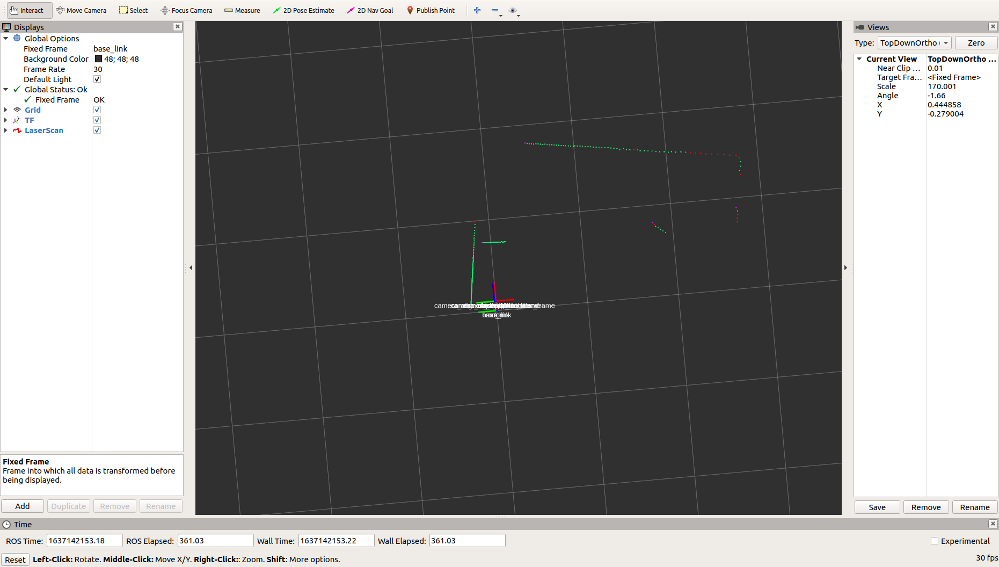

## 1 LIMO Introduction

### 1.1 LIMO Robot

The AgileX LIMO robot is the world's first ROS development platform that integrates four motion modes. It serves as a versatile learning platform that can adapt to a wide range of scenarios and meet industry application requirements. It is well-suited for robot education, function research and development, and product development.

With its innovative mechanical design, the LIMO robot enables swift transitions between four-wheel differential, Ackermann, tracks, and Mecanum wheel motion modes. Additionally, it allows for the establishment of multi-scenario simulation teaching and testing using professional sand tables. Equipped with high-performance sensors such as NUC, EAI T-mini Pro Lidar, and depth cameras, the LIMO robot performs well in precise autonomous positioning, SLAM mapping, route planning, autonomous obstacle avoidance, and traffic light recognition.

### 1.2 Component list

| Name                                          | Quantity |
| --------------------------------------------- | -------- |
| LIMO high-end body（With Off-road wheels X4） | X1       |
| Battery                                       | X1       |
| Charger                                       | X1       |
| APP_Agilex                                    | X1       |

 

### 1.3 Tech specifications

<table>
	<tr>
		<td>Items</td>
		<td>Parameters</td>
        <td>Values</td>
	</tr>
	<tr>
		<td rowspan="7">Mechanical</td>
		<td>Overall dimension</td>
        <td>322*220*251mm</td>
	</tr>
	<tr>
		<td>Wheelbase</td>
        <td>200mm</td>
	</tr>
    	<tr>
		<td>Tread</td>
        <td>175mm</td>
	</tr>
    	<tr>
		<td>Dead load</td>
        <td>4.8kg</td>
	</tr>
    	<tr>
		<td>Load</td>
        <td>4kg</td>
	</tr>
    	<tr>
		<td>Minimum ground clearance</td>
            <td>24mm</td>
	</tr>
    	<tr>
		<td>Drive type</td>
            <td>Hub motor(4x14.4W)</td>
	</tr>
<tr>
		<td rowspan="4">Performance</td>
		<td>No-load max. speed</td>
        <td>1m/s</td>
	</tr>
<tr>
		<td>Ackermann minimum turning radius</td>
        <td>0.4m</td>
	</tr>
<tr>
		<td>Work environment</td>
        <td>-10~+40℃</td>
	</tr>
<tr>
		<td>Max. climbing capacity</td>
        <td>20°</td>
	</tr>
	<td rowspan="11">System</td>
		<td>Power interface</td>
        <td>DC（5.5x2.1mm)</td>
	</tr>
    	<tr>
		<td>IPC</td>
        <td>Interl NUC11</td>
	</tr>
	<tr>
		<td>OS</td>
        <td>Ubuntu22.04</td>
	</tr>
    	<tr>
		<td>IMU</td>
        <td>HI226</td>
	</tr>
    	<tr>
		<td>CPU</td>
        <td>i7-1135G7@2.40GHz x 8</td>
	</tr>
    	<tr>
	</tr>
    	<tr>
		<td>GPU</td>
        <td>Xe Graphics</td>
	</tr>
    	<tr>
		<td>Battery</td>
            <td>10Ah 12V</td>
	</tr>
    	<tr>
		<td>Working time</td>
            <td>2.5H</td>
	</tr>
    	<tr>
		<td>Stand-by time</td>
            <td>4h</td>
	</tr>
    	<tr>
		<td>Communication interface</td>
            <td>WIFI,Bluetooth</td>
	</tr>
	<td rowspan="5">Sensor</td>
		<td>LIDAR</td>
        <td>EAI T-mini Pro</td>
	</tr>
	<tr>
		<td>Depth camera</td>
        <td>DaBai</td>
	</tr>
    	<tr>
		<td>USB-HUB </td>
            <td>TYPE-C x1、USB2.0 x2、HDMI</td>
	</tr>
    	<tr>
		<td>Front display</td>
            <td>1.54 inch 128x64 white OLED display screen</td>
	</tr>
    	<tr>
		<td>Rear display</td>
            <td>7 inch 1024x600 IPS touch screen</td>
	</tr>
	<td rowspan="2">Control</td>
		<td>Control mode</td>
        <td>Mobile APP，command control</td>
	</tr>
	<tr>
		<td>Mobile APP</td>
        <td>Bluetooth，maximum distance 10m</td>
	</tr>
</table>


### 1.4 Operation instructions

（1）Long press the switch to start (short press to pause the program). Observe the electricity meter, and charge or replace the battery in time when the last red light is on.


（2）Observe the status of the front latch and the color of the vehicle light to determine the current mode:


<table>
<tr>
	<td>Latch status</td>
	<td>Color of light</td>
	<td>Current mode</td>
</tr>
	<tr>
        <td rowspan="1">Push down</td> 
        <td>Yellow</td>
        <td>
        4-wheel diff or Track</td>
    </tr>
<tr>
	<td>Pull up</td>
	<td>Green</td>
	<td>Ackerman</td>
</tr>
</table>


<div STYLE="page-break-after: always;"></div>

## 2 Instructions on Chassis Electrical Information

###  2.1 Battery and charging

#### 2.1.1 Basic battery information

LIMO is equipped with a 12V battery with two interfaces. They are the yellow battery output interface and the black battery charging interface.

The parameters of battery are as follow：

| **Items**                            | **Rated parameters** |
| ------------------------------------ | -------------------- |
| Typical capacity                     | 10AH                 |
| Minimum capacity                     | 10AH                 |
| Nominal voltage                      | 11.1V                |
| Charge cut-off voltage               | 12.6V                |
| Discharge cut-off voltage            | 8.25V                |
| Maximum continuous discharge current | 10A                  |

##### Battery precautions

------

- In order to ensure the safety of transportation and storage, the battery supplied with LIMO is not necessarily fully charged.
- Please do not wait until the battery is fully exhausted before charging. And please charge the battery in time when LIMO’s low battery level alarm is on;
- LIMO will still generate a quiescent standby current when it is turned off. To prevent the battery from over-discharging, please disconnect the battery from the vehicle body when you do not use LIMO for a long time.
- Please do not put the battery in fire or heat up the battery, and please do not store the battery in high-temperature environment. The best temperature for battery storage is -25℃~45℃.
- LIMO must be charged with the original factory-equipped or certified battery.

------

####  2.1.2 Charging

LIMO is equipped with a 12.6V 5A charger by default to meet customers’ charging demand. There is an indicator light on the charger to show the charging status.

------

- When charging, please turn off the vehicle and remove the battery, and separate the battery output interface from the vehicle body.
- Connect the charging connector of the charger to the battery, and then turn on the charger's power supply for charging.
- When fully charged, please separate the battery from the charger first, and then disconnect the charger.

------

The charger status is as follows:

| **Charger indicator light’s color** | **Charger status**   |
| ----------------------------------- | -------------------- |
| Red                                 | Charging             |
| Green flashing                      | Almost fully charged |
| Green                               | Fully charged        |

##### Charging precautions:

------

- It is forbidden to use non-original chargers to charge the battery, and do not charge the battery below 0°C.

- When the indicator light of the charger turns green, it indicates that the charging is complete. But to extend the battery usage life, the charger will trickle charge with a current of 0.1A for about 0.5 hours.

- At present, it takes about 2.5 hours for the battery to reach a fully charged state from 8.25V, and the fully charged voltage of the battery is about 12.6V.

## 3 Chassis Driver File

The mobile chassis needs to be driven by a program to achieve the navigation of Limo.  The chassis driver of Limo only has the C++ version at the moment.

### 3.1 Driver file structure

The folder where the chassis driver is located is ~/agilex_ws/src/limo_ros2/limo_base. Enter this folder through the following command.

```
cd ~/agilex_ws/src/limo_ros2/limo_base
```

The following is the file list of the limo_base package:

```
├── CMakeLists.txt
├── include
│   └── limo_base
├── launch
│   ├── limo_base.launch.py
│   ├── open_ydlidar_launch.py
│   └── start_limo.launch.py
├── package.xml
├── scripts
│   └── tf_pub.py
└── src
    ├── limo_base_node.cpp
    ├── limo_driver.cpp
    ├── serial_port.cpp
    └── tf_pub.cpp

```

The message file used by the chassis driver is located in the folder ~/agilex_ws/src/limo_ros2/limo_msgs. Enter this folder through the following command.

```
cd ~/agilex_ws/src/limo_ros2/limo_msgs
```

The following is the file list of the limo_msgs function package.

```
├── action
│   └── LimoAction.action
├── CMakeLists.txt
├── msg
│   └── LimoStatus.msg
├── package.xml
└── srv
    └── LimoSrv.srv

```

There are include, launch, src, scripts, action, srv, and msg folders under the two function packages. The library files called by the driver are stored in the include folder; the driver startup files are stored in the launch folder; the Python code is stored in the scripts folder; the action message files are stored in the action folder; and the srv folder stored the server message files; the msg message file is stored in the msg folder; the driver C++ source code is stored in the src folder.

| **Folder** | **Stored files**                   |
| ---------- | ---------------------------------- |
| include    | Library files called by the driver |
| launch     | Startup files of the driver        |
| msg        | Message files needed by the driver |
| src        | Driver source code                 |
| scripts    | Python code                        |
| action     | action message files               |
| srv        | server message files               |

### 3.2 Msg files

In ROS 2, Msg files (Message files) are used to define custom message types in ROS 2. The Msg file describes the structure and fields of the message, and multiple fields and data types can be defined as needed.

The following is the customized Msg file in Limo called LimoStatus.msg:

```
std_msgs/Header header

uint8 vehicle_state
uint8 control_mode
float64 battery_voltage
uint16 error_code
uint8 motion_mode
```

The message file about Limo status is customized here. The meaning of each field is as follows:

1. std_msgs/Header header: This is a standard message type std_msgs/Header, which contains timestamp and message source information.
2. uint8 vehicle_state: This is an unsigned 8-bit integer type field used to represent vehicle status.
3. uint8 control_mode: This is an unsigned 8-bit integer type field used to represent the control mode.
4. float64 battery_voltage: This is a 64-bit floating point type field used to represent battery voltage.
5. uint16 error_code: This is an unsigned 16-bit integer type field used to represent error codes.
6. uint8 motion_mode: This is an unsigned 8-bit integer type field used to represent motion mode.

This message type can be used in C++ or Python code in ROS 2 nodes for publish and subscribe operations, as well as assignment and access according to the defined fields.

### 3.3 Srv files

Srv files (Service files) are used to define custom service types in ROS 2. The Srv file describes the structure of the requests and responses of service, as well as related fields and data types.

The following is the customized srv file called LimoSrv.srv:

```
# LimoSrv.srv
float32 x
float32 y
float32 z
---
std_msgs/Bool success

```

The meaning of each field is as follows.

The request part contains three fields:

- float32 x: represents the x coordinate value in the request. The type is a 32-bit floating point number.
- float32 y: represents the y coordinate value in the request. The type is a 32-bit floating point number.
- float32 z: represents the z coordinate value in the request. The type is a 32-bit floating point number.

The response part contains a field:

- std_msgs/Bool success：represents the result of service execution. Its type is std_msgs/Bool, used to indicate whether the service was completed successfully.

By defining these fields, this service type enables the transmission of requests containing coordinate values within the ROS 2 system and the subsequent return of execution results. It can be utilized in C++ or Python code within ROS 2 nodes, facilitating both the provision and call of services. 

When acting as the service provider, requests comprising x, y, and z coordinates are received, and appropriate operations are carried out based on the request content. The resulting execution outcomes are then encapsulated into a response of type std_msgs/Bool and transmitted back to the requester.

On the side of the service caller, a request can be created, with the x, y, and z coordinate values populated, and subsequently sent to the service provider. Following this, the response is awaited, and the success field within the response is parsed to get the execution result.

### 3.4 Action files

In ROS 2, Action files are used to define custom Action types. Action types allow long-term asynchronous communication between nodes, and enable more complex behavior by interacting between requests and responses.

The following is the customized Action file called LimoAction.action:

```
# LimoAction.action
float32 x
float32 y
float32 z
---
std_msgs/Bool success
---
uint32 status
```

The meaning of each field is as follows.

The Goal contains three fields:

- float32 x: represents the x coordinate value in the target, which is a 32-bit floating point number.
- float32 y: represents the y coordinate value in the target, which is a 32-bit floating point number.
- float32 z: represents the z coordinate value in the target, which is a 32-bit floating point number.

The Result contains one field:

- std_msgs/Bool success: Represents the result of Action execution. The type is std_msgs/Bool, used to indicate whether the Action is completed successfully.

The Feedback contains one field:

- uint32 status: represents the status of Action execution, the type is an unsigned 32-bit integer.

By defining these fields, this Action type can be used to pass targets containing coordinate values in the ROS 2 system and return feedback on execution results and execution status. You can then use this Action type in C++ or Python code in ROS 2 nodes, for example to create Action clients and servers.

In the Action client, you can create a target, fill in the x, y, and z coordinate values, and send the target to the Action server. Then, wait for the results and feedback to be received, and parse the fields in the results and feedback to obtain the execution results and execution status.

On the Action server side, you can receive a target containing x, y, and z coordinates and perform corresponding operations based on the target. Then, the execution results and status are encapsulated into results and feedback and sent to the Action client.

### 3.5 Limo topic

In ROS 2, topic is a common communication mechanism used to transmit messages between ROS 2 nodes. It adopts a publish-subscribe (Publish-Subscribe) model, in which one node publishes messages to a specific topic, and other nodes subscribe to the topic to receive messages.

Start the Limo chassis driver:

```
ros2 launch limo_base limo_base.launch.py
```

The following topics will be posted when starting the Limo chassis driver:

```
/cmd_vel
/imu
/limo_status
/parameter_events
/rosout
/tf
/tf_static
/wheel/odom
```


Here is a brief explanation of these ROS 2 topics:

1. /cmd_vel：
   - Function: Used to control the speed and direction of the robot.
   - Message type: geometry_msgs/msg/Twist
2. /imu：
   - Function: Publish the data of the Inertial Measurement Unit (IMU), such as acceleration, angular velocity and attitude.
   - Message type: sensor_msgs/msg/Imu.
3. /limo_status：
   - Function: Publish information about the status of the robot, such as battery power, error codes, etc.
   - Message type: Custom message type, depending on the specific application.
4. /parameter_events：
   - Function: Publish events related to the ROS parameter server, such as parameter modification, addition or deletion.
   - Message type: rcl_interfaces/ParameterEvent.
5. /rosout：
   - Function: Used to record log messages of ROS nodes.
   - Message type: rosgraph_msgs/Log.
6. /tf：
   - Function: Publish the coordinate transformation information of the robot, used to realize the conversion between coordinate systems.
   - Message type: tf2_msgs/msg/TFMessage.
7. /tf_static：
   - Function: Publish static coordinate transformation information, similar to the /tf topic, but these transformations will not change over time.
   - Message type: tf2_msgs/msg/TFMessage.
8. /wheel/odom：
   - Function: Publish robot wheel odometer data to estimate the robot's movement on the ground.
   - Message type: nav_msgs/msg/Odometry.

## 4 LiDAR Mapping

### 4.1 Introduction and use of LiDAR

YDLIDAR T-mini Pro lidar is a 360° 2D lidar (hereinafter referred to as T-mini Pro) developed by Shenzhen EAI Technology Co., Ltd. This product is based on the pulse ToF ranging principle, and is equipped with related optical, electrical, and algorithm designs to achieve high-frequency and high-precision distance measurement. At the same time, the mechanical structure rotates 360 degrees to continuously obtain angle information, thereby achieving 360-degree scanning ranging. , output the point cloud data of the scanning environment.

| Items              | Minimum | Default | Maximum | Unit | Remarks                                                      |
| ------------------ | ------- | ------- | ------- | ---- | ------------------------------------------------------------ |
| Ranging frequency  | /       | 4000    | /       | Hz   | 4000 ranging times per second                                |
| Scanning frequency | 6       | 6       | 12      | Hz   | PWM signal needs to be connected, and the recommended frequency is 6Hz. |
| Ranging range      | 0.02    | /       | 12      | m    | Indoor environment, and objects with 80% reflectivity        |
| Scanning angle     | /       | 0-360   | /       | Deg  | /                                                            |
| Ranging accuracy   | /       | 20      | /       | mm   | When 0.05m <ranging≤12m                                      |
| Pitch angle        | 0       | 0.75    | 1.5     | Deg  | /                                                            |
| Angle resolution   | 0.54    |         |         | Deg  |                                                              |

Here's how to use it:

Launch a new terminal and enter the command:

```
ros2 launch ydlidar_ros2_driver ydlidar.launch.py
```

After launching successfully, the terminal will output the following log information, as shown in the figure:


Then launch a new terminal and enter the command in the terminal:

```
ros2 launch limo_bringup lidar_rviz.launch
```

After the rviz visualization software runs successfully, the green data displayed is the laser data scanned by LiDAR.



Message type of scan topic: sensor_msgs/msg/LaserScan.

- `header`: Message header, including timestamp, frame ID and other information.
- `angle_min`: The minimum angle for laser scanning.
- `angle_max`: The maximum angle of laser scanning.
- `angle_increment`: Angle increment of laser scanning.
- `time_increment`: Time increment for each laser scan.
- `scan_time`: Total time of laser scanning.
- `range_min`: the minimum range of laser ranging.
- `range_max`: The maximum range of laser ranging.
- `ranges`: an array of laser ranging data, representing the distance value corresponding to each angle.
- `intensities`: array of laser ranging intensity data, optional field.

By subscribing to the `/scan` topic, other nodes can receive and process lidar scan data. Common applications include mapping, obstacle detection, navigation and path planning.

### 4.2 Cartographer mapping

#### 4.2.1 Introduction of cartographer algorithm

Cartographer is a set of SLAM algorithms based on image optimization launched by Google. The main goal of this algorithm is to achieve low computing resource consumption and achieve the purpose of real-time SLAM. The algorithm is mainly divided into two parts. The first part is called Local SLAM. This part establishes and maintains a series of Submaps through each frame of the Laser Scan, and the so-called submap is a series of Grid Maps. The second part called Global SLAM, is to perform closed-loop detection through Loop Closure to eliminate accumulated errors: when a submap is built, no new laser scans will be inserted into the submap. The algorithm will add the submap to the closed-loop detection.

#### 4.2.2 Operation of cartographer mapping

> **Note:** Before running the command, please make sure that the programs in other terminals have been terminated. The termination command is: Ctrl+c.

> **Note:** The speed of limo should be slow  in the process of mapping. If the speed is too fast, the effect of mapping will be affected.

First, start the LiDAR. Launch a new terminal and enter the command:

```
ros2 launch limo_bringup limo_start.launch.py
```

Then start the cartographer mapping algorithm. Open another new terminal and enter the command:

```
ros2 launch limo_bringup limo_cartographer.launch.py
```

After launching successfully, the rviz visualization interface will be shown in the figure below:

After building the map, it is necessary to save it. Three following commands need to be entered in the terminal:

```
ros2 run nav2_map_server map_saver_cli -f map
```


## 5 LiDAR Navigation

Two laser mapping methods were used above. Then use the map just built to navigate.

### 5.1 Navigation framework

The key to navigation is robot positioning and path planning. For these, ROS provides the following two packages.

（1）move_base：achieve the optimal path planning in robot navigation.

（2）amcl：achieve robot positioning in a two-dimensional map.

On the basis of the above two packages, ROS provides a complete navigation framework.


The robot only needs to publish the necessary sensor information and navigation goal position, and ROS can complete the navigation function. In this framework, the move_base package provides the main operation and interactive interface of navigation. In order to ensure the accuracy of the navigation path, the robot also needs to accurately locate its own position. This part of the function is implemented by the amcl package.

#### 5.1.1 Move_base package

Move_base is a package for path planning in ROS, which is mainly composed of the following two planners.

(1) Global path planning (global_planner). Global path planning is to plan the overall path according to a given goal position and global map. In navigation, Dijkstra or A* algorithm is used for global path planning, and the optimal route from the robot to the goal position is calculated as the robot's global path.

(2) Local real-time planning (local_planner). In practice, robots often cannot strictly follow the global path. So it is necessary to plan the path that the robot should travel in each cycle according to the map information and obstacles that may appear near the robot at any time. So that it conforms to the global optimal path as much as possible.

#### 5.1.2 Amcl package

Autonomous positioning means that the robot can calculate its position on the map in any state. ROS provides developers with an adaptive (or kld sampling) Monte Carlo localization (amcl), which is a probabilistic positioning system that locates mobile robots in 2D. It implements an adaptive (or KLD-sampling) Monte Carlo localization, using particle filtering to track the pose of the robot on a known map.

#### 5.1.3 Introduction of DWA_planner and TEB_planner

DWA_planner

The full name of DWA is Dynamic Window Approaches. The algorithm can search for multiple paths to avoid and travel, select the optimal path based on various evaluation criteria (whether it will hit an obstacle, the time required, etc.), and calculate the linear velocity and angular velocity during the driving cycle to avoid collisions with dynamic obstacles.

TEB_planner

The full name of "TEB" is Time Elastic Band Local Planner. This method performs subsequent modifications to the initial trajectory generated by the global path planner to optimize the robot's motion trajectory. It falls under the category of local path planning. During the trajectory optimization process, the algorithm takes into account various optimization goals, which include but are not limited to minimizing overall path length, optimizing trajectory execution time, ensuring a safe distance from obstacles, passing through intermediate path points, and complying with the robot's dynamics, kinematics, and geometric constraints. The "TEB method" explicitly considers the dynamic constraints of time and space during the robot's motion. For instance, it considers limitations on the robot's velocity and acceleration.

### 5.2 Limo navigation

> **Note:** In the four-wheel differential mode, the omnidirectional wheel mode and the track mode, the  file run for the navigation is the same.

**Note:** Before running the command, please make sure that the programs in other terminals have been terminated. The termination command is: Ctrl+c.

（1）First launch the LiDAR and enter the command in the terminal:：

```
ros2 launch limo_bringup limo_start.launch.py
```

（2）Launch the navigation and enter the command in the terminal:

```
ros2 launch limo_bringup limo_nav2.launch.py
```

**Note:** If it is Ackermann motion mode, please run:

```
roslaunch limo_bringup limo_navigation_ackerman.launch
```

After launching successfully, the rviz interface will be shown in the figure below:


> **Note:** If you need to customize the opened map, please open the limo_navigation_diff.launch file to modify the parameters. The file directory is: ~/agilex_ws/src/limo_ros/limo_bringup/launch. Please modify map02 to the name of the map that needs to be replaced.


（3）After launching the navigation, it may be observed that the laser-scanned shape does not align with the map, requiring manual correction. To rectify this, adjust the actual position of the chassis in the scene displayed on the rviz map. 

Use the rviz tools to designate an approximate position for the vehicle, providing it with a preliminary estimation. Subsequently, use the handle tool to remotely rotate the vehicle until automatic alignment is achieved. Once the laser shape overlaps with the scene shape on the map, the correction process is concluded. The operational steps are outlined as follows:


The correction is completed:

（4）Set the navigation goal point through 2D Nav Goal.


A purple path will be generated on the map. Switch the handle to command mode, and Limo will automatically navigate to the goal point.

（5）Multi-point navigation

Click the button in the red box to enter multi-point navigation mode.


Click Nav2 Goal and add points on the map. After adding points, click the button in the red box to start navigation.


## 6 Visual mapping and navigation

### 6.1 Introduction and use of ORBBEC®Dabai

ORBBEC®Dabai is a depth camera based on binocular structured light 3D imaging technology. It mainly includes a left infrared camera (IR camera1), a right infrared camera (IR camera2), an IR projector, and a depth processor. The IR projector is used to project the structured light pattern (speckle pattern) to the goal scene, the left infrared camera and the right infrared camera respectively collect the left infrared structured light image and the right infrared structured light image of the goal, and the depth processor executes the depth calculation algorithm and outputs the depth image of the goal scene after receiving the left infrared structured light image and the right infrared structured light image.

| **Parameter name**                                           | **Parameter index**                                          |
| ------------------------------------------------------------ | ------------------------------------------------------------ |
| The distance between the imaging centers of the left and right infrared cameras | 40mm                                                         |
| Depth distance                                               | 0.3-3m                                                       |
| Power consumption                                            | The average power consumption of the whole machine <2W;<br/>The peak value at the moment the laser is turned on <5W (duration: 3ms);<br/>Typical standby power consumption <0.7W. |
| Depth map resolution                                         | 640X400@30FPS<br/>320X200@30FPS                              |
| Color map resolution                                         | 1920X1080@30FPS<br/>1280X720@30FPS<br/>640X480@30FPS         |
| Accuracy                                                     | 6mm@1m (81% FOV area participates in accuracy calculation*)  |
| Depth FOV                                                    | H 67.9° V 45.3°                                              |
| Color FOV                                                    | H 71° V43.7° @1920X1080                                      |
| Delay                                                        | 30-45ms                                                      |
| Data transmission                                            | USB2.0 or above                                              |
| Supported operating system                                   | Android / Linux / Windows7/10                                |
| Power supply mode                                            | USB                                                          |
| Operating temperature                                        | 10°C ~ 40°C                                                  |
| Applicable scene                                             | Indoor / outdoor (specifically subject to application scenes and related algorithm requirements) |
| Dustproof and waterproof                                     | Basic dustproof                                              |
| Safety                                                       | Class1 laser                                                 |
| Dimensions (mm)                                              | Length 59.6 X width 17.4 X thickness 11.1mm                  |

After knowing the basic parameters of ORBBEC®Dabai, start to practice：

**Note:** Before running the command, please make sure that the programs in other terminals have been terminated. The termination command is: Ctrl+c

First ,start the ORBBEC®Dabai camera. Run the following command:

```
ros2 launch astra_camera dabai.launch.py
```

Open rqt_image_view:

```
ros2 run rqt_image_view rqt_image_view
```


### 6.2 Introduction of rtabmap algorithm

RTAB-Map (Real-Time Appearance-Based Mapping) is an algorithm for Simultaneous Localization and Mapping (SLAM) that aims to achieve a balance between real-time performance and map quality. RTAB-Map is a graph-based SLAM system that can build dense 3D maps at runtime (real-time).

Some of the key features and components of RTAB-Map are as follows:

1. **Real-time Performance:** RTAB-Map is specifically designed to operate in real-time applications, such as robot navigation and augmented reality systems. It employs an algorithm that minimizes computational requirements while achieving fast and accurate map construction and positioning, even with limited computing resources.
2. **Feature-based SLAM:** RTAB-Map utilizes visual and inertial sensor data to perform feature matching. It extracts key points and descriptors from consecutive frames to enable simultaneous localization and mapping (SLAM), even without precise motion models. This feature allows for robust mapping and localization in dynamic environments.
3. **Environment Awareness:** RTAB-Map incorporates environment awareness techniques to enhance map quality. It takes into account depth information, parallax, and other environmental factors, which is particularly beneficial in scenarios with less texture or repetitive structures. This improves the reliability and accuracy of the generated maps.
4. **Loop Detection and Closed-loop Optimization:** RTAB-Map includes loop detection mechanisms to identify previously visited areas within the map. It then employs optimization techniques to correct previous trajectories and maps based on the loop closure information. This ensures consistency in the map representation and reduces errors over time.
5. **RGB-D Sensor Support:** RTAB-Map provides direct support for RGB-D sensors, such as the Microsoft Kinect. By utilizing depth information from these sensors, RTAB-Map enhances the accuracy and density of the generated maps. This support for RGB-D sensors enables more detailed and comprehensive mapping capabilities.

### 6.3 Rtabmap algorithm mapping

> Note: Before running the command, please make sure that the programs in other terminals have been terminated. The termination command is: Ctrl+c.

> Note: The speed of limo should be low in the process of mapping. If it is too fast, the effect of mapping will be affected.

（1）First launch the LiDAR. Enter the command in the terminal:

```
ros2 launch limo_bringup limo_start.launch.py
```

（2）Launch the camera. Enter the command in the terminal:

```
ros2 launch astra_camera dabai.launch.py
```

（3）Launch the mapping mode of the rtabmap algorithm. Enter the command in the terminal:

```
ros2 launch limo_bringup limo_rtab_rgbd.launch.py
```

After building the map, the program can be terminated directly. The built map will be automatically saved in the main directory as a .ros file named rtabmap.db. The .ros folder is hidden and can be displayed using the Ctrl+h command.


### 6.4 Rtabmap algorithm navigation

> **Note:** Before running the command, please make sure that the programs in other terminals have been terminated. The termination command is: Ctrl+c.

（1）First launch the LiDAR. Enter the command in the terminal:

```
ros2 launch limo_bringup limo_start.launch.py
```

（2）Launch the camera. Enter the command in the terminal:

```
ros2 launch astra_camera dabai.launch.py
```

（3）Start the mapping mode of rtabmap algorithm. Enter the command in the terminal:

```
ros2 launch limo_bringup limo_rtab_rgbd.launch.py localization:=true
```

（4）Start the navigation algorithm. Enter the command in the terminal:

```
ros2 launch limo_bringup limo_rtab_nav2.launch.py 
```


（5）Because visual positioning is used, there is no need for calibration when using rtabmap navigation. Users can directly start setting the target points and proceed with navigation. The operational steps are shown in the figure.


A green path will be generated in the map. Switch the handle to command mode, and Limo will automatically navigate to the goal point.

## 6 Vision Module

### 6.1 Vision-based Line Following

**Code Logic**

1. Firstly, the camera needs to be initialized. The image information is obtained by subscribing to the messages published by the camera, and the image is converted to the OpenCV format.
2. The obtained image is preprocessed, including operations such as grayscale conversion, Gaussian blur, and edge detection.
3. The preprocessed image is binarized to convert it into a black and white binary image.
4. Morphological operations, such as dilation, erosion, and opening, are applied to the binary image to enhance line detection.
5. Hough transform is used to detect lines, which are then drawn on the image.
6. By analyzing the slope and position of the detected lines, the direction in which the robot needs to turn is determined, and the robot is controlled to move towards the target direction.

**Function Implementation**

Launch the camera.

```
ros2 launch astra_camera dabai.launch.py
```

Place the car in the sandbox and activate the vision-based line following function.

```
ros2 run limo_visions detect_line 
```


### 6.2 Color Tracking

Visual color tracking is an object detection and tracking technique based on image processing, which allows real-time tracking and localization of objects of specific colors.

**Code Logic**

1. Initialize ROS node and camera subscriber: First, you need to initialize a ROS node using the rclcpp library in ROS2, and create a subscriber to subscribe to image messages. Convert the image messages from ROS to OpenCV format using the cv_bridge library.
2. Define color range and mask: In this code, we will take the blue color target as an example for tracking. First, define a range object in OpenCV to represent the color range. Then, use the inRange function in OpenCV to convert the image to a binary mask, which filters out the target region for further processing.
3. Detect and draw bounding boxes: The target region in the mask may contain noise and other non-target regions. To identify the exact position of the target region, you can use the findContours function in OpenCV to find the contours and use the boundingRect function to calculate the bounding box of the target region. Then, use the rectangle function to draw the bounding box on the original image.
4. Publish the target position: Lastly, you can use a publisher in ROS2 to publish the target position to other nodes for further control and navigation.

**Function Implementation**

Launch the camera.

```
ros2 launch astra_camera dabai.launch.py
```

Place the colored block within the view range of the limo and activate the color tracking function:

```
ros2 run limo_visions object_detect 
```


### 6.3 QR Code Tracking

A QR code is a graphic composed of black and white elements, which records data and symbol information. It is arranged on a plane according to specific rules and geometric shapes in a two-dimensional direction. In its encoding, it cleverly utilizes the concepts of "0" and "1" bit streams, which form the fundamental basis of internal computer logic. Several geometric shapes corresponding to binary are used to represent textual and numerical information, enabling automatic reading through image input devices or photoelectric scanning equipment to achieve automated information processing. 

QR code shares common features with barcode technology, such as each coding system having its own specific character set, each character occupying a designated width, and incorporating specific verification functions. Additionally, it has the capability to automatically identify different lines of information and process changes resulting from graphic rotation.

In ROS2, the aruco_ros function package is utilized for QR code identification. aruco_ros is a function package developed based on OpenCV, written in C++, and provides a C++ interface.

**Generate QR code:**

URL to generate QR code: http://chev.me/arucogen/; you can generate different QR codes according to your own needs

The QR code used in this example is:


**Function Implementation**

Launch the camera.

```
ros2 launch astra_camera dabai.launch.py
```

Place the QR code within the field of view of Limo, and activate the QR code recognition function.

```
ros2 launch aruco_ros single.launch.py
```

Launch the QR code recognition function.

```
ros2 run limo_visions move_to_ar
```


### 6.4 Traffic light recognition

**Code Logic**:

1. Initialize the ROS2 node and create an image subscriber and image publisher.
2. Read the image and convert it to HSV color space.
3. Define the color range of red and green and apply it to the image through the inRange function to obtain a binary image.
4. Perform morphological operations on binary images to remove noise and fill holes.
5. Find the contours in the image through the findContours function, and find the circumscribed circle of each contour through the minEnclosingCircle function.
6. For each circumscribed circle, calculate its area and center coordinates. If the area is larger than the threshold and the center of the circle is within the predefined traffic light area, it can be marked as a traffic light.
7. Draw the circumscribed circle of the traffic light in the original image and publish it to the ROS2 topic.
8. Repeat the above steps in a loop and wait for the next image to arrive.

**Function Implementation**：

Launch the camera.

```
ros2 launch astra_camera dabai.launch.py
```

Place the QR code within the field of view of Limo, and activate the traffic light recognition function.

```
ros2 run limo_visions detect_traffic
```


## Appendix 1 Remote desktop connection

#### 1. Download and install NoMachine

First download the corresponding software on personal computer. 

Download link: https://www.nomachine.com/download. 

Download the corresponding version according to your computer's operating system and architecture. Connect limo and computer to the same WIFI.             

#### 2. Connect to wifi

Open the seagull door on the right side of limo, find the USB-HUB module, and connect the keyboard and mouse to limo. The position of the USB-HUB module is as shown in the figure below:


After the keyboard and mouse are successfully connected, select the wifi that needs to be connected.


Enter the password of wifi:


#### 3. Connect to Limo remotely

Select connection object


Username：agilex   Password：agx 

Select to save the password.


Always select the default option : OK.


